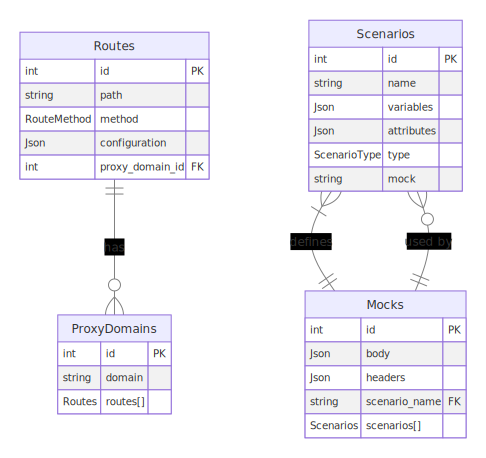

## Mock Server

* **What is it?**

A mock server is a tool that can simulate the behavior of a real server. It can be used to test and develop applications without having to rely on a real server.

* **Features:**

This mock server supports the following features:

    * Routing: The mock server can be configured to handle different routes, each with its own response.
    * Proxying: The mock server can be configured to proxy requests to other servers.
    * Scenarios: The mock server can be configured to simulate different scenarios, such as errors and delays.

* **Usage:**

To use the mock server, you will need to:

1. Install it.
2. Configure it to handle the requests that you want it to simulate.
3. Start it.
4. Send requests to it using your favorite HTTP client.

* **Configuration:**

The mock server can be configured using a JSON configuration file. The configuration file specifies the routes that the mock server should handle, the proxy domains that the mock server should proxy requests to, and the scenarios that the mock server can simulate.

* **Routes:**

A route is a configuration for a specific request path and method. Routes can be configured to return a mock response, proxy the request to another server, or redirect the request to a different path.

Each route configuration must include the following properties:

    * path: The path of the request that the route matches.
    * method: The method of the request that the route matches.
    * configuration: The configuration for the route.

The configuration property can contain the following properties:

    * scenarios: A list of scenarios that the route can use.
    * variables: A list of variables that the route can use.

* **Scenarios:**

A scenario is a configuration for a specific behavior that the mock server can simulate. Scenarios can be used to simulate errors, delays, and other behaviors.

Each scenario configuration must include the following properties:

    * name: The name of the scenario.
    * mock: The mock response that the scenario returns.

* **Mock Responses:**

A mock response is a configuration for a response that the mock server can return. Mock responses can be configured to return a specific status code, body, and headers.

Each mock response configuration must include the following properties:

    * body: The body of the response.
    * headers: The headers of the response.

* **Variables:**

Variables can be used to fetch data from the request. For example, the following variable would fetch the `applicationId` variable from the request URL:

Use code with caution. Learn more
request.originalUrl.split('/')[7]

This variable could be used in a mock response to return a specific response for the specific application ID.

Example:
The following example shows how to configure a mock server to handle a request to the /api/v1/applications/:applicationId/risk-evaluation endpoint:

<!-- Insert image mock-server.architecture.png -->



## Mock Routing System Documentation
This document provides a detailed overview of the Mock Routing System, designed to mock API responses for specific scenarios or proxy requests to a real domain. The system is built using Prisma with PostgreSQL as the database.

### Database Schema
The schema consists of four main models: Routes, ProxyDomains, Scenarios, and Mocks. Each plays a crucial role in determining how requests are routed and handled.

## Models
### Routes
Description: Represents the API routes that can be either mocked or proxied.
Fields:
id: Unique identifier.
createdAt, updatedAt: Timestamps.
path: The route path, supporting SQL wildcards for dynamic matching.
method: HTTP method (POST, GET, etc.).
configuration: JSON containing scenarios and variables for condition matching.
proxy_domain_id: References the ProxyDomains model for proxying.

### ProxyDomains
Description: Specifies the real domain to which requests can be proxied if conditions are not met for mocking.
Fields:
id: Unique identifier.
domain: The actual domain URL.
createdAt, updatedAt: Timestamps.

### Scenarios
Description: Defines conditions under which a specific mock response should be used.
Fields:
id: Unique identifier.
name: A unique name for the scenario.
variables: JSON specifying variables for condition matching.
attributes: Additional JSON attributes for the scenario.
createdAt, updatedAt: Timestamps.
type: The type of scenario (FIXED, TEMPORARY).

### Mocks
Description: Contains mock responses for scenarios.
Fields:
id: Unique identifier.
body: JSON representing the mock response body.
headers: JSON representing the response headers.
scenario_name: References the Scenarios model.
Inserting Data

## Mock Example
To insert a mock for a successful risk evaluation:

```
INSERT INTO public."Mocks" (body, headers, scenario_name) VALUES
('{"message": "Risk evaluation successful."}',
'{"statusCode": 200, "Content-Type": "application/json"}',
'RISK_EVALUATION_SUCCESS');
```

## Scenario Linked to the Mock
Linking a scenario to the mock:

```
INSERT INTO public."Scenarios" ("name", "createdAt", "updatedAt", "type", "attributes", "variables") VALUES
('RISK_EVALUATION_SUCCESS', '2023-09-21 11:18:29.000', '2023-09-21 11:18:29.000', 'FIXED', '{}', '{"customerId": "123"}');
```
This scenario indicates that if a route receives a request with applicationId: 123, the mock response for RISK_EVALUATION_SUCCESS should be used.

## Route Configuration
Configuring a route to use the scenario and mock:

```
INSERT INTO public."Routes" ("createdAt", "updatedAt", "path", "method", "configuration", "proxy_domain_id") VALUES
('2023-09-21 11:44:13.029', '2023-09-21 11:44:13.029', '/ro/api/v1/customers/%', 'POST',
'{"scenarios": ["RISK_EVALUATION_ERROR", "RISK1_EVALUATION_SUCCESS"], "variables": {"customerId": "123"}}', 1);
```

## Proxy Domain
Specifying a proxy domain:

```
INSERT INTO public."ProxyDomains" ("domain", "createdAt", "updatedAt") VALUES
('https://youractualdomain.com', '2023-09-21 11:27:00.669', '2023-09-21 11:27:00.669');
```

## Routing Logic 
For each request, the router checks the path and method against the Routes table to find a matching route. If a match is found, it then examines the configuration for that route to determine the conditions under which a mock response should be used.
The configuration of a route includes scenarios and variables. The system looks for these variables within the request (e.g., in the request body or URL) to determine if the conditions for a specific scenario are met.
If the request matches a scenario's conditions (e.g., applicationId: 123), the system uses the corresponding mock response from the Mocks table.
Variables can also be dynamic. For example, a variable could be specified as "sourceChannel": "request.body.sourceChannel", meaning the system will look for sourceChannel in the request's body.
If no scenario conditions are met or if no matching scenario is found for the route, the request is forwarded to the specified proxy domain from the ProxyDomains table. This means the request will be sent to an actual server, effectively bypassing the mock logic.

## Example Usage
### Dynamic Routing and Mocking
Consider a case where an application needs to test different outcomes for an API endpoint /ro/api/v1/customers/%/applications/%/lender/% with the POST method. You can configure scenarios for specific responses, like RISK1_EVALUATION_SUCCESS, and define what constitutes a match for this scenario (e.g., "applicationId": "123").

This flexibility allows for comprehensive testing of various outcomes without needing to deploy changes to a live or staging backend, facilitating faster development cycles and more robust testing scenarios.

### Proxying Unmatched Requests
For requests that do not match any configured scenario or when you want to ensure real-world interaction for certain conditions, the system proxies the request to a real server. This hybrid approach of mocking and proxying offers a balance between isolation for testing and integration for real-world behavior.

## Dynamic Mocks 

The mock routing system supports dynamic mocks, allowing you to insert variables directly into your mock JSON responses. This feature is particularly useful for simulating more realistic and context-specific responses based on the request parameters or other dynamic data.

### How It Works

In your mock JSON, you can include placeholders for variables using double curly braces, like `{{variableName}}`. When a request is processed, the system performs a string replacement, substituting these placeholders with the actual values found in the router configuration or passed in the request.

**Note**: Currently, dynamic substitution is supported only for strings. Ensure that your variables in the router configuration and the placeholders in your mock JSON are correctly set up for this feature to work.

### Example

Let's consider an example where you want to dynamically insert a user's name into a mock response. Your router configuration includes a variable named `name`, which you intend to use in your mock response.

1. **Router Configuration**:

   In your router's configuration, you specify how to obtain the `name` variable, perhaps from the request URL or body.

   ```json
   "variables": {
       "name": "request.url.name"
   }
   
   
 ## Mock JSON:

In your mock response JSON, use the placeholder {{name}} where you want the user's name to appear.

```
{
    "message": "Hello, {{name}}! Welcome to our system."
}
```
## Dynamic Substitution:

When a request is processed, the system replaces {{name}} with the actual name value from the router configuration. If a request comes in with the name value set to "John", the mock response would be:

```
{
    "message": "Hello, John! Welcome to our system."
}
```
By leveraging dynamic mocks, you can create more versatile and responsive mock scenarios, enhancing your testing and development process.


## Getting Started

Follow these steps to get your environment set up and your application running:

1. **Start PostgreSQL using Docker**: Navigate to the development environment's directory and use the provided `docker-compose.yml` file to start PostgreSQL.

    ```bash
    cd dev
    docker-compose up -d
    ```

2. **Install Dependencies**: Use `bun` to install your project's dependencies. If you're using npm or another package manager, adjust this command accordingly.

    ```bash
    bun install
    ```

3. **Generate Prisma Client**: Generate the Prisma client to interact with your database. This step is crucial for using Prisma ORM effectively.

    ```bash
    npx prisma generate
    ```

4. **Start the Application**: Finally, start your application. The command might vary depending on your `package.json` scripts.

    ```bash
    npm run start
    ```

By following these steps, you should have your application up and running, connected to a PostgreSQL database managed through Docker, and ready for development.

